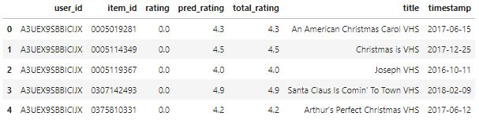

# Рекомендация фильмов и сериалов
Необходимо построить рекомендательную систему на основе данных рейтинга продаж фильмов и сериалов. Исходные данные по рейтингу фильмов и сериалов на https://nijianmo.github.io/amazon/index.html

## Подключение библиотек
```python
# Импорт основных библиотек
import json
import gzip

# Импорт библиотек по анализу данных
import numpy as np
import pandas as pd

# Импорт библиотек по машинному обучению
from sklearn.metrics import mean_squared_error
from sklearn.metrics.pairwise import cosine_similarity
from sklearn.base import BaseEstimator
from sklearn.feature_extraction.text import TfidfVectorizer, TfidfTransformer
```

## Загрузка исходных данных
```python
# Функция чтения данных из файла json
def parse_json(path):
    for line in gzip.open(path, 'rb'):
        yield json.loads(line)

# Функция загрузки данных из файла json в датафрейм
def get_dataframe(path):
    data = {}
    for i, item in enumerate(parse_json(path)):
        data[i] = item
        
    return pd.DataFrame.from_dict(data, orient='index')
```

```python
# Загрузка данных по рейтингу продаж фильмов и сериалов
rating_data = pd.read_csv('Movies_and_TV.csv', names=['asin', 'reviewer_id', 'rating', 'timestamp'])
rating_data.head()
```


```python
# Загрузка данных описания фильмов и сериалов
description_data = get_dataframe('meta_Movies_and_TV.json.gz')
description_data.head(3)
```


```python
# Объединение загруженных данных в один датафрейм
movies_data = rating_data.merge(description_data[['asin', 'title']].drop_duplicates(), on='asin', how='left')
movies_data.columns = ['item_id', 'user_id', 'rating', 'timestamp', 'title']
movies_data.head()
```


## Разведочный анализ
```python
# Вывод информации о структуре данных
movies_data.info(show_counts=True)
```
```
<class 'pandas.core.frame.DataFrame'>
Int64Index: 8765568 entries, 0 to 8765567
Data columns (total 5 columns):
 #   Column     Non-Null Count    Dtype  
---  ------     --------------    -----  
 0   item_id    8765568 non-null  object 
 1   user_id    8765568 non-null  object 
 2   rating     8765568 non-null  float64
 3   timestamp  8765568 non-null  int64  
 4   title      8752845 non-null  object 
dtypes: float64(1), int64(1), object(3)
memory usage: 401.3+ MB
```

```python
# Вывод списка фильмов и количество просмотров
movies_data.item_id.value_counts()
```
```
B00YSG2ZPA    24558
B00006CXSS    24489
B000WGWQG8    23584
B00AQVMZKQ    21015
B01BHTSIOC    20889
              ...  
B007ROO1I4        1
B007RP4D0E        1
B001ELYZVE        1
B0009XRZRO        1
B01HJF79XO        1
Name: item_id, Length: 182032, dtype: int64
```

```python
# Вывод списка покупателей и количество покупок
movies_data.user_id.value_counts()
```
```
AV6QDP8Q0ONK4     4254
A1GGOC9PVDXW7Z    2292
A328S9RN3U5M68    2175
ABO2ZI2Y5DQ9T     2136
AWG2O9C42XW5G     2046
                  ... 
A1BB0FQDUTMIG7       1
A2CWLZB35HZ29V       1
A33W466BOHSO6E       1
A1UZA20ZYKNDPX       1
AK19IXB9I4175        1
Name: user_id, Length: 3826085, dtype: int64
```

```python
# Вывод списка рейтингов
movies_data.rating.value_counts()
```
```
5.0    5491586
4.0    1498047
3.0     735907
1.0     633153
2.0     406875
Name: rating, dtype: int64
```

```python
# Вывод списка названий фильмов
movies_data.title.value_counts()
```
```
Band of Brothers(Elite SC/BD+DCExp12-21)                  24558
Band Of Brothers (DVD)                                    24489
John Adams                                                23584
Downton Abbey - Series 4                                  21015
Doctor Thorne - Season 1 2015                             20889
                                                          ...  
9/11 Toxic Dust                                               1
Train Unlim:power.speed:dies                                  1
A&amp;E: Crime 360 - Welcome To Homicide                      1
Japans Atomic Bomb                                            1
Mobile Suit Gundam Thunderbolt Limited Edition Blu-ray        1
Name: title, Length: 177968, dtype: int64
```

## Предобработка данных
```python
# Преобразование времени в соответствующий тип данных
movies_data['timestamp'] = pd.to_datetime(movies_data['timestamp'], unit='s')
movies_data.head()
```


```python
# Выборка данных за последние 3-и года
indx = movies_data['timestamp'] > (movies_data['timestamp'].max() - pd.Timedelta('1095D'))
movies_data = movies_data[indx]

# Исключение непопулярных фильмов и покупателей с малым числом покупок
movies_data = movies_data[movies_data.groupby('item_id').transform('count').iloc[:, 0] > 50]
movies_data = movies_data[movies_data.groupby('user_id').transform('count').iloc[:, 0] > 30]

# Удаление пустых позиций из датафрейма
movies_data = movies_data.drop_duplicates(['item_id', 'user_id']).dropna()

# Вывод первых позиций
movies_data.shape
```
```
(65020, 5)
```
## Построение модели
```python
# Функция разбиения данных на тренировочную и тестовую выборки
def train_test_split(data, ratio=0.2, user_col='user_id', item_col='item_id',
                     rating_col='rating', time_col='timestamp'):
    data = data.sort_values(by=[time_col])
    
    indx = int(len(data) * (1 - ratio))
    train_data = data[[user_col, item_col, rating_col]][:indx]
    test_data = data[[user_col, item_col, rating_col]][indx:]
    
    return train_data, test_data

# Функция построения сводных таблиц
def pivot_table(data, values='rating', index='user_id', columns='item_id'):
    rows, rows_pos = np.unique(data[index], return_inverse=True)
    cols, cols_pos = np.unique(data[columns], return_inverse=True)
    
    table = np.zeros((len(rows), len(cols)), dtype=np.float16)
    table[rows_pos, cols_pos] = data[values]
    
    return pd.DataFrame(table, index=rows, columns=cols)

# Класс модели коллаборативной фильтрации на основе схожести покупателей
class UserBased(BaseEstimator):
    def fit(self, train_data, user_col='user_id', item_col='item_id', rating_col='rating'):
        # Создание копии данных
        data = train_data.copy()

        # Определение списка покупателей и товаров
        self.users = data[user_col].unique()
        self.items = data[item_col].unique()
        
        # Определение среднего рейтинга товара для каждого покупателя
        self.rating_mean = data.groupby(user_col)[rating_col].mean()

        # Расчет среднего рейтинга товара для каждого покупателя в датафрейме
        data[rating_col] = data[rating_col] - data.groupby(user_col)[rating_col].transform('mean')

        # Построение сводной таблицы рейтингов товаров в разрезе покупателя и товара
        self.ratings = pivot_table(data, values=rating_col, index=user_col, columns=item_col)

        # Расчет коэффициента схожести покупателей
        self.similarities = pd.DataFrame(cosine_similarity(self.ratings), index=self.ratings.index)

        return self
    
    def predict_rating(self, pr_user, pr_item):
        # Для отсутствующих покупателей и товаров устанавливаем нулевой рейтинг
        if not pr_item in self.items or not pr_user in self.users:
            return 0
        
        # Расчет прогнозного значения рейтинга товара на основе коэффициента схожести
        numerator = np.dot(self.similarities.loc[pr_user], self.ratings.loc[:, pr_item])
        denominator = self.similarities.loc[pr_user].sum() - 1
        
        return self.rating_mean[pr_user] + numerator / denominator
    
    def predict(self, test_data, user_col='user_id', item_col='item_id'):
        # Расчет прогнозных значений рейтингов товаров
        rating_pred = test_data[[user_col, item_col]].apply(lambda row: self.predict_rating(row[0], row[1]), axis=1)
        return rating_pred

# Класс модели коллаборативной фильтрации на основе схожести товаров
class ItemBased(BaseEstimator):
    def fit(self, train_data, user_col='user_id', item_col='item_id', rating_col='rating'):
        # Создание копии данных
        data = train_data.copy()

        # Определение списка покупателей и товаров
        self.users = data[user_col].unique()
        self.items = data[item_col].unique()
        
        # Определение среднего рейтинга для каждого товара
        self.rating_mean = data.groupby(item_col)[rating_col].mean()

        # Расчет среднего рейтинга каждого товара в датафрейме
        data[rating_col] = data[rating_col] - data.groupby(item_col)[rating_col].transform('mean')

        # Построение сводной таблицы рейтингов товаров в разрезе покупателя и товара
        self.ratings = pivot_table(data, values=rating_col, index=item_col, columns=user_col)

        # Расчет коэффициента схожести товаров
        self.similarities = pd.DataFrame(cosine_similarity(self.ratings), index=self.ratings.index)

        return self
    
    def predict_rating(self, pr_user, pr_item):
        # Для отсутствующих покупателей и товаров устанавливаем нулевой рейтинг
        if not pr_item in self.items or not pr_user in self.users:
            return 0
        
        # Расчет прогнозного значения рейтинга товара на основе коэффициента схожести
        numerator = np.dot(self.similarities.loc[pr_item], self.ratings.loc[:, pr_user])
        denominator = self.similarities.loc[pr_item].sum() - 1
        
        return self.rating_mean[pr_item] + numerator / denominator
    
    def predict(self, test_data, user_col='user_id', item_col='item_id'):
        # Расчет прогнозных значений рейтингов товаров
        rating_pred = test_data[[user_col, item_col]].apply(lambda row: self.predict_rating(row[0], row[1]), axis=1)
        return rating_pred


# Функция расчета коэффициента RMSE
def RMSE(Y_true, Y_pred):
    return np.sqrt(mean_squared_error(Y_true, Y_pred))

# Функция вывода названий фильмов
def print_movies(head_print, movie_titles):
    print('\033[1m' + head_print + '\033[0m')
    print('--------------------------------------------')
    for title in movie_titles:
        print(title)
```

```python
# Разбиение выборки на тренировочную и тестовую
train_data, test_data = train_test_split(movies_data, ratio=0.01)

# Вывод размеров выборок
print(train_data.shape, test_data.shape)
```
```
(64369, 3) (651, 3)
```

```python
# Построение модели и прогнозирование рейтинга фильмов на основе схожести покупателей
print('Запуск обучения...')
ub_model = UserBased().fit(train_data)
print('Запуск прогнозирования...')
ub_pred = ub_model.predict(test_data)
print('RMSE = {:0.4f}'.format(RMSE(test_data['rating'], ub_pred)))
```
```
Запуск обучения...
Запуск прогнозирования...
RMSE = 1.2503
```

```python
# Вывод спрогнозированных рейтингов фильмов
ub_rating = pd.concat([test_data['rating'], ub_pred], axis=1)
ub_rating.columns = ['rating', 'ub_rating']
ub_rating.head()
```


```python
# Построение модели и прогнозирование рейтинга фильмов на основе схожести фильмов
print('Запуск обучения...')
ib_model = ItemBased().fit(train_data)
print('Запуск прогнозирования...')
ib_pred = ib_model.predict(test_data)
print('RMSE = {:0.4f}'.format(RMSE(test_data['rating'], ib_pred)))
```
```
Запуск обучения...
Запуск прогнозирования...
RMSE = 1.3634
```

```python
# Вывод спрогнозированных рейтингов фильмов
ib_rating = pd.concat([test_data['rating'], ib_pred], axis=1)
ib_rating.columns = ['rating', 'ib_rating']
ib_rating.head()
```


```python
# Расчет среднего значения рейтинга фильмов
mean_rating = pd.concat([ub_rating, ib_rating['ib_rating']], axis=1)
mean_rating['mean_rating'] = (mean_rating['ub_rating'] + mean_rating['ib_rating']) / 2

# Вывод оценки качества двух моделей
print('RMSE = {:0.4f}'.format(RMSE(test_data['rating'], mean_rating['mean_rating'])))
```
```
RMSE = 1.2464
```

```python
# Вывод средних значений рейтинга фильмов
mean_rating.head()
```


```python
# Случайно выбранный покупатель для построения системы рекомендаций
user_id = 'A3UEX9SBBICIJX'

# Построение вектора покупателя
user_vector = pivot_table(movies_data).loc[user_id].reset_index()
user_vector['user_id'] = user_id

# Переименование столбцов датафрейма и задание нужной последовательности
user_vector.columns = ['item_id', 'rating', 'user_id']
user_vector = user_vector[['user_id', 'item_id', 'rating']]

# Вывод первых позиций
user_vector.head()
```


```python
# Построение прогноза рейтинга неприобретенных фильмов
rating_null = user_vector[user_vector['rating']==0]
rating_pred = np.round((ub_model.predict(rating_null) + ib_model.predict(rating_null)) / 2, 1)

# Объединение реальных и прогнозных рейтингов фильмов
movie_rating = pd.concat([user_vector, rating_pred], axis=1).fillna(0)
movie_rating.columns = ['user_id', 'item_id', 'rating', 'pred_rating']

# Исключение фильмов с низким реальным и прогнозным рейтингами
movie_rating['total_rating'] = movie_rating['rating'] + movie_rating['pred_rating']
movie_rating = movie_rating[(4 <= movie_rating.total_rating) & (movie_rating.total_rating <= 5)]
movie_rating.head()
```


```python
# Построение списка наименований фильмов с меткой времени
movie_titles = movies_data.groupby(['item_id', 'title'])['timestamp'].max().reset_index()

# Добавление наименований фильмов и меток времени в датафрейм рейтингов
movie_rating = movie_rating.merge(movie_titles, how='left', on='item_id')
movie_rating.head()
```


```python
# Определение И вывод ТОП-лучших приобретенных фильмов покупателем
top_movies = movie_rating[movie_rating.rating > 4].sort_values('timestamp', ascending=False).title
print_movies('ТОП-10 последних просмотренных фильмов', top_movies.unique()[:10])
```
```
ТОП-10 последних просмотренных фильмов
--------------------------------------------
Jurassic World
Halloween: The Complete Collection
Kick-Ass 2 [DVD] [Import]
Kick-Ass
Moneyball
Man of Steel
42
X-Men Origins: Wolverine
Trading Places VHS
Turner &amp; Hooch [NON-USA Format / PAL / Region 4 Import - Australia]
```

```python
# Построение векторного представления слов из названий фильмов
tfidf = TfidfVectorizer(analyzer='word', stop_words='english')
tfidf_matrix = tfidf.fit_transform(movie_rating['title'])

# Определение коэффициентов схожести фильмов по наименованию
cosine_similarities = cosine_similarity(tfidf_matrix)

# Выборка фильмов с лучшим прогнозным рейтингом и коэффициентом схожести
indx = movie_rating[movie_rating.rating > 4].index.to_list()
similar_movies = [similar_indx[-3:-1] for similar_indx in cosine_similarities[indx].argsort(axis=1)]
similar_movies = np.array(similar_movies).flatten()

# Вывод ТОП-лучших из предлагаемых к просмотру фильмов
top_movies = movie_rating.iloc[similar_movies].sort_values(['pred_rating', 'timestamp'], ascending=False).title
print_movies('ТОП-10 предлагаемых к просмотру фильмов', top_movies.unique()[:10])
```
```
ТОП-10 предлагаемых к просмотру фильмов
--------------------------------------------
Jurassic Park Collection (Jurassic Park / The Lost World: Jurassic Park / Jurassic Park III)
Empire of the Sun
Big Trouble
Brian Regan: Live From Radio City Music Hall
Rookie Blue: Season 6
Zatoichi - The Blind Swordsman Box
Beyond the Lights
Doc Martin Series 1 Region 2
Viva Las Vegas
All the Way (Digital HD/DVD)
```
